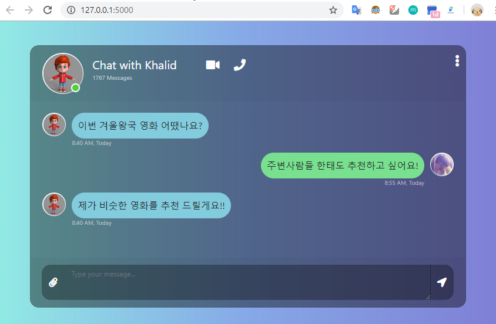
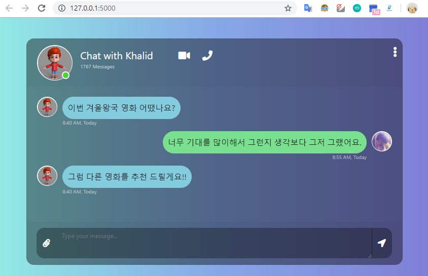

# 딥러닝을 이용한 영화리뷰 감정분석 챗봇

딥러닝 학습을 위해 만들어본 **영화리뷰 감정분석 챗봇** 입니다. 아래는 딥러닝 관련 참고 사이트 입니다.

  * Wikidocs 딥러닝을 이용한 자연어 처리 입문(https://wikidocs.net/44249)
  * 네이버 영화 리뷰 감성 분류하기(https://github.com/e9t/nsmc/)
  * Tensorflow를 이용한 Machine Lerning 기초(https://www.tensorflow.org/tutorials/keras/classification)

챗봇 서비스 느낌이 나도록 간단하게 웹페이지를 개발하였습니다. 아래는 개발에 참고한 자료입니다.

  * Flask에서 JQuery 사용(https://pythonprogramming.net/jquery-flask-tutorial/)
  * 채팅 UI 템플릿(https://bootsnipp.com/snippets/nNg98)

## 미리보기

**[Positive Prediction Case]**



Log 내용

```
[model.py] Start Predicting~!
[model.py] <<<  주변사람들 한태도 추천하고 싶어요!
[model.py] Deleting Special Character..
[model.py] >>>  주변사람들 한태도 추천하고 싶어요
[model.py] Tockenization Special Character..
[model.py] >>>  ['주변', '사람', '들', '한', '태도', '추천', '하고', '싶다']
[model.py] Deleting Stopword..
[model.py] >>>  [['주변', '사람', '태도', '추천', '하고', '싶다']]
[model.py] Loading tockenized data..
[model.py] >>>  [[1583, 40, 3781, 221, 66, 74]]
[model.py] Syncing array size..
[model.py] >>>  [[   0    0    0    0    0    0    0    0    0    0    0    0    0    0
     0    0    0    0    0    0    0    0    0    0 1583   40 3781  221
    66   74]]
[model.py] Preprocessing Done!
[model.py] Predicting Done!: 0.7022808790206909 , Positive
[app.py] 예측값:  0.7022808790206909 , 판단:  Positive
```

**[Negative Prediction Case]**



Log 내용

```
[model.py] Start Predicting~!
[model.py] <<<  너무 기대를 많이해서 그런지 생각보다 그저 그랬어요.
[model.py] Deleting Special Character..
[model.py] >>>  너무 기대를 많이해서 그런지 생각보다 그저 그랬어요
[model.py] Tockenization Special Character..
[model.py] >>>  ['너무', '기대', '를', '많이', '해', '서', '그렇다', '생각', '보다', '그저', '그렇다']
[model.py] Deleting Stopword..
[model.py] >>>  [['너무', '기대', '많이', '해', '서', '그렇다', '생각', '보다', '그저', '그렇다']]
[model.py] Loading tockenized data..
[model.py] >>>  [[8, 264, 125, 425, 142, 73, 34, 2, 469, 73]]
[model.py] Syncing array size..
[model.py] >>>  [[  0   0   0   0   0   0   0   0   0   0   0   0   0   0   0   0   0   0
    0   0   8 264 125 425 142  73  34   2 469  73]]
[model.py] Preprocessing Done!
[model.py] Predicting Done!: 0.2078140377998352 , Negative
[app.py] 예측값:  0.2078140377998352 , 판단:  Negative
```

## 환경구성

작업을 위해 환경구성한 내용을 설명합니다.

#### 딥러딩을 위한 환경구성

  1. [Anaconda 2019.10(Python 3.7)](https://www.anaconda.com/distribution/#download-section) 설치
  2. `python -m pip install -U pip`
  3. `pip install tensorflow`
  4. `pip install nltk`
  5. `pip install konlpy`
  6. `pip install -q h5py pyyaml`

#### 웹 개발을 위한 환경구성

  1. `pip install flask`

## 데이터셋 수집

데이터셋은 [여기](https://github.com/e9t/nsmc/)에서 이미 수집된 데이터 20만개를 사용하였습니다. 아래는 데이터셋 파일 입니다.

  * **ratings_train.txt**: 학습용(15만개)
  * **ratings_test.txt**: 모델 평가용(5만개)


## 모델 만들기

모델을 만들기 위해서는 Jupyter Note 파일 **model/model_gen.ipynb** 을 실행하면 됩니다. 실행하면 동일 폴더에 **model_file.h5**와 **tokenizer.json** 파일이 생성됩니다. 학습에서 사용했던 단어 인덱싱한 규칙을 그대로 적용해야 해당 모델이 유효하기 때문에 모델을 사용하기 위해서는 아래 두개 파일이 같이 사용되어야 합니다.

  * **model_file.h5**: 모델 파일
  * **tokenizer.json**: 토큰 인덱싱 파일
